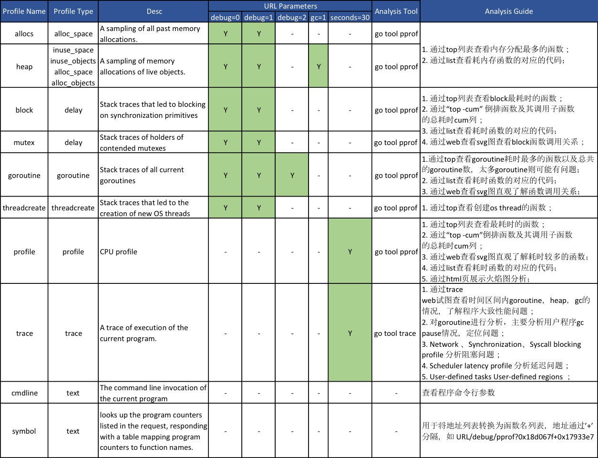

<!---
markmeta_title: golang性能分析工具pprof
markmeta_author: 望哥
markmeta_date: 2018-09-26 21:41:42
markmeta_tags: golang,pprof,performance
markmeta_categories: 编程语言
-->

# golang性能分析工具pprof

## 1. pprof 介绍

profiling一般翻译为画像，在计算机性能调试领域里就是对程序应用的画像，主要指应用使用 CPU 和内存等情况。

golang自带pprof(program profile)工具可以收集并分析程序画像。

pprof读取一组[profile.proto](https://github.com/google/pprof/blob/master/proto/profile.proto)(protocol buffer格式)数据，产生可视化的数据分析报告。因此，它可以分析可以任意产生这种格式的程序，不管程序是什么语言开发的。

pprof 采样数据主要有三种获取方式:
- runtime/pprof: 手动调用runtime.StartCPUProfile和runtime.StopCPUProfile等 API来生成和写入采样文件，灵活性高。参考[范例](https://golang.org/pkg/runtime/pprof/)
- net/http/pprof: 通过 http 服务获取Profile采样文件，简单易用，适用于对应用程序的整体监控。通过 runtime/pprof 实现。参考[范例](https://golang.org/pkg/net/http/pprof/)
- go test: 通过 `go test -bench . -cpuprofile cpu.prof -memprofile mem.prof` 生成采样文件 适用对函数进行针对性测试.

使用pprof生产svg图时需要Graphviz工具，mac下可以通过此命令安装: `brew install Graphviz`

查看pprof工具的详细用法, 运行命令查看usage说明: `go tool pprof`

## 2. pprof 画像类型

如果http程序是通过添加 `import _ "net/http/pprof"` 支持抓取应用画像.

```
package main

import (
	"net/http"
	_ "net/http/pprof"
)

func main() {
	go func() {
		log.Println(http.ListenAndServe(":6060", nil))
	}()

	// business

	select {}
}

```

则可以通过 `http://localhost:6060/debug/pprof/`地址查看各种画像的样例统计数量，
并可以通过以下地址查看或下载对应的画像内容。

```
http://localhost:6060/debug/pprof/<PROFILE_NAME>
```

以上url地址中`<PROFILE_NAME>`参考下表：


**debug参数**:
- debug=0时(默认)，返回 pprof 工具所需数据格式文件。
- debug=1时，将函数地址转换为函数名，即脱离 pprof 在浏览器中直接查看。
- debug=2时，对goroutine来说，此时将以 unrecovered panic 的格式打印堆栈，可读性更高。

**gc参数**: 抓取heap画像时，指定gc=1时，会先进行gc再生成heap画像；

**seconds参数**: 针对cpu和trace两类画像，可以通过seconds指定要抓取分析的时间周期。

## 3. pprof 使用经验

```bash
# pprof工具支持直接对http服务画像地址抓取并分析
go tool pprof http://localhost:6060/debug/pprof/profile?seconds=30

# 分析heap
# 1. top -cum
# 2. list github.com/vogo/logger.init
go tool pprof http://localhost:6060/debug/pprof/heap

go tool pprof --inuse_objects http://localhost:6060/debug/pprof/heap
go tool pprof --alloc_space http://localhost:6060/debug/pprof/heap
go tool pprof --alloc_objects http://localhost:6060/debug/pprof/heap


# 常常需要抓取各类profile并事后再仔细分析，这时可以先保存下profile文件，如:
curl -o cpu.prof http://localhost:6060/debug/pprof/profile?seconds=30

# pprof支持用http方式查看各类分析数据，而且从1.11版本开始http方式下还可以生成火焰图,更方便对程序性能进行分析:
go tool pprof -http=:8080 cpu.prof
go tool pprof -http=:8080 mem.prof

# linux 命令查看进程信息
ps -o 'rss,vsz,pcpu,comm' -e  |grep logger
ps -o 'rss,vsz,pcpu,comm' -p 1234
```

## 4. go test bench 性能测试参数

- `-benchmem`：打印用于基准的内存分配统计数据。
- `-blockprofile block.out`：当所有的测试都完成时，在指定的文件中写入一个 goroutine 阻塞概要文件
- `-blockprofilerate n`：goroutine 阻塞时候打点的纳秒数。默认不设置就相当于 -test.blockprofilerate=1，每一纳秒都打点记录一下。
- `-coverprofile cover.out`：在所有测试通过后，将覆盖概要文件写到文件中。设置过 -cover。
- `-cpuprofile cpu.out`：在退出之前，将一个 CPU 概要文件写入指定的文件。
- `-memprofile mem.out`：在所有测试通过后，将内存概要文件写到文件中。
- `-memprofilerate n`：开启更精确的内存配置。如果为 1，将会记录所有内存分配到 profile。
- `-mutexprofile mutex.out`：当所有的测试都完成时，在指定的文件中写入一个互斥锁争用概要文件。指定 -c，将写入测试二进制文件。
- `-mutexprofilefraction n`：样本 1 在 n 个堆栈中，goroutines 持有 a，争用互斥锁。
- `-outputdir directory`：在指定的目录中放置输出文件，默认情况下，go test 正在运行的目录。
- `-trace trace.out`：在退出之前，将执行跟踪写入指定文件。

指定测试文件生成prof文件:
```
go test logger_test.go logger.go --bench . -cpuprofile cpu.prof  -memprofile mem.prof
```

## 4. 参考

- [runtime/pprof/pprof.go](https://github.com/golang/go/blob/master/src/runtime/pprof/pprof.go)
- [net/http/pprof/pprof.go](https://github.com/golang/go/blob/master/src/net/http/pprof/pprof.go)
- [Profiling Go Programs](https://blog.golang.org/profiling-go-programs)


