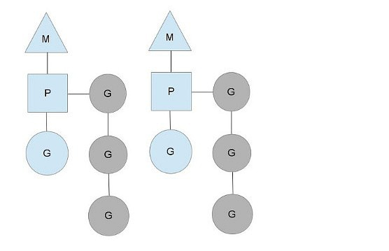
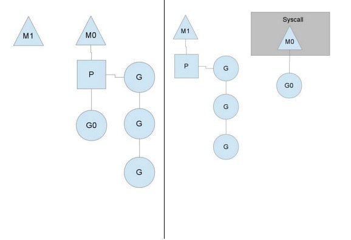
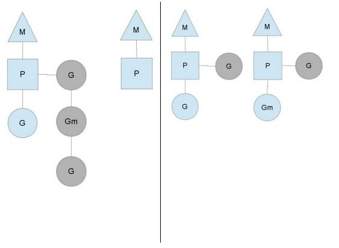

<!---
markmeta_author: wongoo
markmeta_date: 2019-03-12
markmeta_title: Go 调度器
markmeta_categories: 编程语言
markmeta_tags: golang,scheduler
-->

# Go调度器

## 为何需要go调度器

POSIX线程API是对现有Unix进程模型的一个非常大的逻辑扩展，而且线程获得了非常多的跟进程相同的控制。
比如，线程有它自己的信号掩码，线程能够被赋予CPU affinity功能(就是指定线程只能在某个CPU上运行），线程能被添加到[cgroups](http://en.wikipedia.org/wiki/Cgroup)中，线程所用到的资源也可以被查询到。
所有的这些控制增大了Go程序使用gorroutines时根本不需要的特性（features）的开销，当你的程序有100,000个线程的时候，这些开销会急剧增长。

另外一个问题是，基于Go模型，操作系统不能给出特别好的决策。
比如，当运行一次垃圾收集的时候，Go的垃圾收集器要求所有线程都被停止而且要求内存要处于一致状态（consistent state）。
这就要等待全部运行时线程（running threads）都到达一个内存是一致的点的时候。

当很多被调度的线程分散在随机的点（random point）上的时候，结果就是你不得不等待他们中的大多数到达一致状态。
Go调度器能够作出这样的决策，只要知道内存是处于一致状态点的时候就能够进行调度。
这就意味着，当程序为垃圾收集而停止的时候，只须等待在同一个CPU核（CPU core）上处于活跃运行状态的线程（到达一致状态）即可。

## 角色

目前有三个常见的线程模型。
- `N：1`： 即多个用户空间线程运行在一个OS线程上。这个模型可以很快的进行上下文切换，但是不能利用多核系统（multi-core systems)的优势。
- `1：1`： 即可执行程序的一个线程匹配一个OS线程。这个模型能够利用机器上的所有核心的优势，但是上下文切换非常慢，因为它不得不陷入OS（trap through the OS）。
- `M：N`:  go调度器去获取这两个世界的全部优势。它在任意数目的OS线程上调用任意数目的goroutines。你可以快速进行上下文切换，并且还能利用你系统上所有的核心的优势。这个模型主要的缺点是它增加了调度器的复杂性。

为了完成调度任务，Go调度器使用了三个实体：
- `M: machine`, OS线程，它是由OS管理的可执行程序的一个线程，而且工作起来特别像你的标准POSIX线程。
- `G: goroutine`, 它包括栈、指令指针以及对于调用goroutines很重要的其它信息，比如阻塞它的任何channel。
- `P: processor`, 调用的上下文。可以把它看作在一个单线程上运行代码的调度器的一个本地化版本。

两个线程（M），每个线程都拥有一个上下文（P），每个线程都正在运行一个goroutine（G）。为了运行goroutines，一个线程必须拥有一个上下文。

上下文的数目在启动时被设置为环境变量GOMAXPROCS的值或者通过运行时函数GOMAXPROCS()来设置。
通常，在你的程序执行时它不会发生变化。上下文的数目被固定的意思是，只有GOMAXPROCS个上下文正在任意点上运行Go代码。
我们可以使用GOMAXPROCS调整Go进程的调用使其适合于一个单独的计算机，比如一个4核的PC中可以在4个线程上运行Go代码。

外部的灰色goroutines没在运行，但是已经准备好被调度了。它们被安排成一个叫做runqueue的列表。当一个goroutine执行一个go 语句的时候，goroutine就被添加到runqueue的末端。一旦一个上下文已经运行一个goroutine到了一个点上，它就会把一个goroutine从它的runqueue给pop出来，设置栈和指令指针并且开始运行这个goroutine。

为了降低mutex竞争，每一个上下文都有它自己的runqueue。Go调度器曾经的一个版本只有一个通过mutex来保护的全局runqueue，线程们经常被阻塞来等待mutex被解除阻塞。当你有许多32核的机器而且想尽可能地压榨它们的性能时，情况就会变得相当坏。

只要所有的上下文都有goroutines要运行，调度器就能在一个稳定的状态下保持调度。但是有几个你能改变的场景。

## 系统调用

当我们需要调用一个系统调用的时候。因为一个线程不能既执行代码同时又阻塞到一个系统调用上，我们需要移交对应于这个线程的上下文以让这个上下文保持调度。

从上图我们能够看出，一个线程放弃了它的上下文以让另外的线程可以运行它。调度器确保有足够的线程来运行所有的上下文。上图中的M1 可能仅仅为了让它处理图中的系统调用而被创建出来，或者它可能来自一个线程池（thread cache）。这个处于系统调用中的线程将会保持在这个导致系统调用的goroutine上，因为从技术上来说，它仍然在执行，虽然阻塞在OS里了。

当这个系统调用返回的时候，这个线程必须尝试获取一个上下文来运行这个返回的goroutine，操作的正常模式是从其它所有线程中的其中一个线程中“偷”一个上下文。如果“偷盗”不成功，它就会把它的goroutine放到一个全局runqueue中，然后把自己放到线程池中或者转入睡眠状态。

这个全局runqueue是各个上下文在运行完自己的本地runqueue后用来获取新goroutine的地方。上下文也会周期性的检查这个全局runqueue上的goroutine，否则，全局runqueue上的goroutines可能得不到执行而饿死。

`Go程序要在多线程上运行的原因就是因为要处理系统调用，哪怕GOMAXPROCS等于1`。运行时(runtime)使用调用系统调用的goroutines，而不是线程。

## 盗取工作（Stealing work）

系统的稳定状态改变的另外一个方法是，当一个上下文运行完要被调度的所有goroutines的时候。
如果各个上下文的runqueue里的工作的数目不均衡，改变就会发生了，否则会导致一个上下文在执行完它的runqueue后就会结束，尽管系统中仍然有许多工作要执行。
所以为了保持运行Go代码，一个上下文能够从全局runqueue中获取goroutines，但是如果全局runqueue中也没有goroutines了，那么上下文就不得不从其它地方获取goroutines了。

这个“其它地方”指的是其它上下文！当一个上下文完成自己的任务后，它就会尝试“盗取”另一个上下文runqueue中工作量的一半。
这将确保每个上下文总是有活干，然后反过来确保所有线程尽可能处于最大负荷。

## 参考
- 原始设计文档, https://docs.google.com/document/d/1TTj4T2JO42uD5ID9e89oa0sLKhJYD0Y_kqxDv3I3XMw
- Go调度器原理浅析(翻译), https://www.douban.com/note/300631999/

